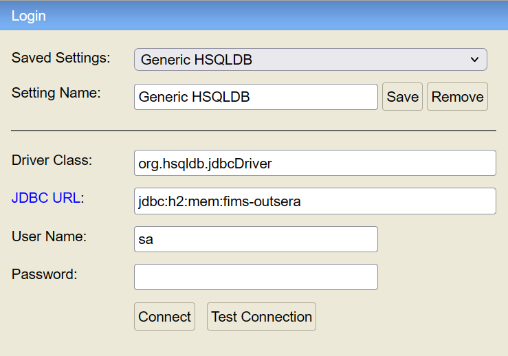

# Golden Raspberry Awards API

## Descrição
API desenvolvida para fornecer informações sobre os intervalos de prêmios dos produtores de filmes que ganharam o Golden Raspberry Awards. 

---

**Pré-requisitos**
Certifique-se de ter as seguintes ferramentas instaladas em sua máquina:  
**Java JDK 21 ou superior**
---

## Como executar o projeto

1. **Obter o projeto**

   1.1. [Clone o repositório](https://github.com/andersonmeurer/filmsOutsera.git)
 ou

   1.2. [Faça o download do projeto](https://github.com/andersonmeurer/filmsOutsera/archive/refs/heads/main.zip)


2. **Execute o projeto**:
```
./mvnw spring-boot:run
```
3. **Consulta de Intervalos de Prêmios**:
- Endpoint para intervalos de prêmios:
[http://localhost:8080/producers/intervals](http://localhost:8080/producers/intervals)
```
http://localhost:8080/producers/intervals
```

## Como executar os testes
```
./mvnw test
 ```
---
# Extras

---

### Comando curl para post do arquivo CSV
- Permite importar um arquivo CSV contendo a lista de filmes.

```
curl -X POST "http://localhost:8080/import" -d "filePath=./src/main/resources/movielist.csv" -H "Content-Type: application/x-www-form-urlencoded"
```

### View para o banco de dados 
[Clique aqui para cessar](http://localhost:8080/h2-console)
````
http://localhost:8080/h2-console
````
